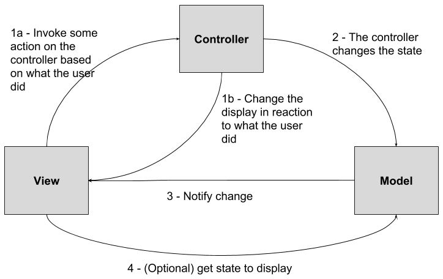
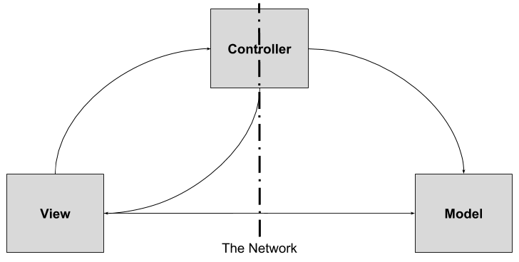

# Socket programming

The project in this folder contains examples for socket programming.

# Trivial examples

During class, we will focus on the implementation of a simple echo server (and
client) in order to learn the basics of Java socket programming.

Have a look at the `socket.trivial.echo` package to see a preview.

We will also deepen serialization and deserialization by looking at practical
examples (see `SerdeTest` in the `src/test/...` directory).

# The Chat - Distributed MVC with Socket

As the final part of the exercise, we will analyze the `socket.chat` package.
It contains a client/server implementation of our beloved chat.

The implementation follows the MVC pattern and distributes it over the client
and the server.

Remember that the MVC pattern identifies three entities:

  + __The model__: hold all the state and application logic
  + __The view__: gives a representation of the model
  + __The controller__: maps the user input from the view to state changes in the model



When the MVC is distributed, one must decide where to split and introduce a
networking layer to make the method calls become remote. It seems natural (and I
did so with the chat) to split the Controller into a client-side and a
server-side part.



By splitting, we also intercept the edge that connects the Model and the View.
That edge is really important because it handles the notifications that the
Model sends to its observer.

If you have a look at the code you can see that we have two controllers ---
`ClientController` and `ServerController` --- but also that we had to implement
the notification behavior in the `network` package.

You are __highly encouraged__ to have a look at the `network` package and try to
understand by yourself what I did (hint:
[command](https://en.wikipedia.org/wiki/Command_pattern) and
[visitor](https://en.wikipedia.org/wiki/Visitor_pattern) patterns).

For what concerns the Model, I reused the code developed during the last
lecture, in the `chat` project. If you have a look at the `pom.xml`, you can see
that this project depends on it:

```
...
<dependency>
    <groupId>deib.ingsoft18</groupId>
    <artifactId>chat</artifactId>
    <version>1.0-SNAPSHOT</version>
</dependency>
...
```

Be sure of running `mvn install` in the `chat` before building this project.
